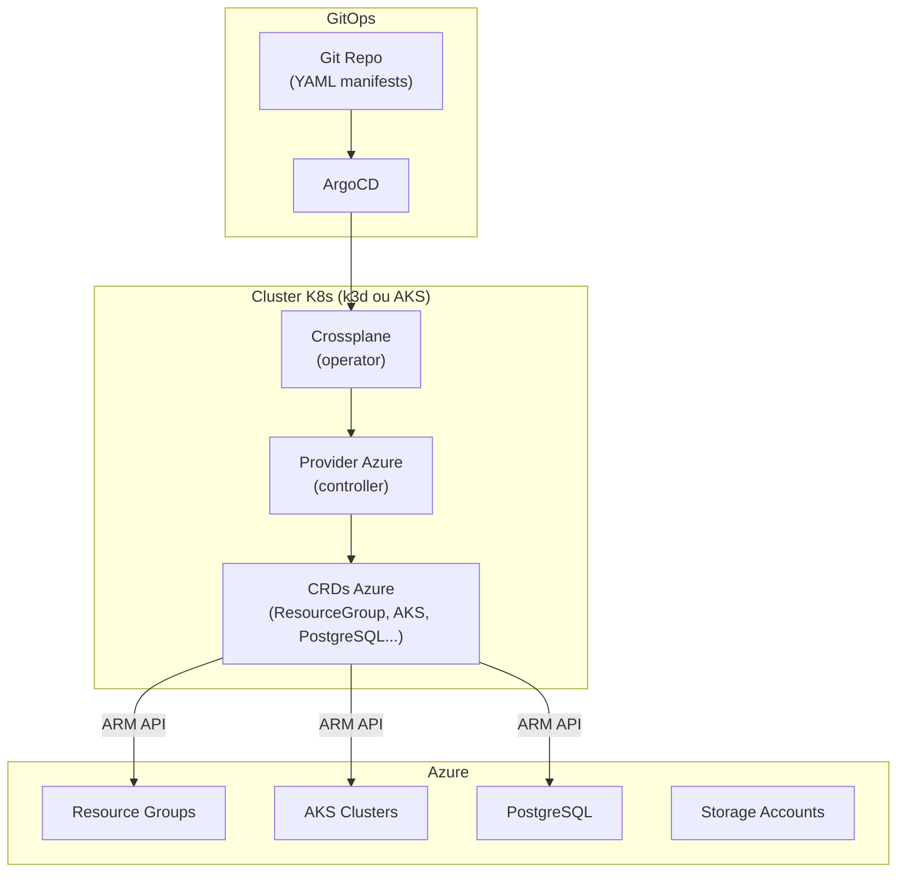

# Crossplane — Infrastructure as Code K8s-native

## C'est quoi ?

Crossplane transforme ton cluster Kubernetes en **control plane universel**. Tu crées une base de données Azure SQL, un AKS cluster, ou un bucket Azure Storage avec un fichier YAML K8s — exactement comme tu crées un Deployment ou un Service. Crossplane réconcilie l'état désiré dans le YAML avec l'état réel dans Azure.

**Avantage sur Terraform** : même workflow GitOps que ton infra K8s, pas d'outil externe, reconciliation continue.

## Architecture



## Installation

```bash
# Prérequis : être sur le bon cluster
kubectl config use-context k3d-devops-lab

# Installer Crossplane
helm repo add crossplane-stable https://charts.crossplane.io/stable
helm repo update
helm install crossplane \
  crossplane-stable/crossplane \
  --namespace crossplane-system \
  --create-namespace

# Attendre que les pods soient Running
kubectl get pods -n crossplane-system -w
```

## Configurer le provider Azure

```bash
# 1. Installer le provider
kubectl apply -f - <<EOF
apiVersion: pkg.crossplane.io/v1
kind: Provider
metadata:
  name: upbound-provider-azure
spec:
  package: xpkg.upbound.io/upbound/provider-azure-resources:latest
EOF

# 2. Attendre l'installation
kubectl get providers -w

# 3. Créer les credentials Azure
az ad sp create-for-rbac \
  --name crossplane-lab \
  --role Contributor \
  --scopes /subscriptions/$(az account show --query id -o tsv) \
  --sdk-auth > azure-creds.json

kubectl create secret generic azure-secret \
  -n crossplane-system \
  --from-file=creds=./azure-creds.json
rm azure-creds.json  # ne pas garder en clair

# 4. Configurer le provider
kubectl apply -f tools/crossplane/manifests/provider-config.yaml
```

## Créer des ressources Azure

```bash
# Resource Group
kubectl apply -f tools/crossplane/manifests/resource-group.yaml

# Suivre le provisioning
kubectl get resourcegroups.azure.upbound.io -w

# Voir toutes les ressources gérées
kubectl get managed
kubectl describe resourcegroup crossplane-demo-rg
```

## Concept : Compositions

Les Compositions permettent de créer des abstractions haut-niveau. Par exemple, une `XDatabase` qui crée automatiquement un Resource Group + un PostgreSQL + le networking :

```yaml
apiVersion: database.example.org/v1alpha1
kind: XDatabase
metadata:
  name: mon-app-db
spec:
  location: francecentral
  size: small
```

## Utilisation

```bash
# Lister les types de ressources Azure disponibles
kubectl get crds | grep azure | head -20

# Voir l'état de réconciliation
kubectl get managed -o wide

# Supprimer une ressource (supprime dans Azure aussi)
kubectl delete resourcegroup crossplane-demo-rg
```

## Liens

- [[_index|← Retour Infrastructure]]
- [[k3d|k3d — Cluster local pour tester Crossplane]]
- [[../03-securite/_index|03-sécurité — External Secrets avec Crossplane]]
