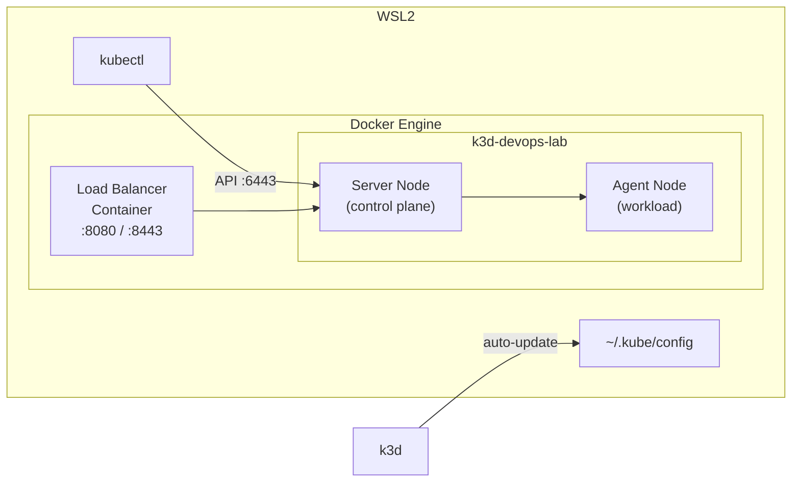

# k3d — Cluster Kubernetes local

## C'est quoi ?

k3d est un wrapper qui fait tourner **k3s** (Kubernetes allégé par Rancher Labs) à l'intérieur de containers Docker. Résultat : un vrai cluster Kubernetes multi-nœuds qui démarre en 20 secondes, sans VM, sans overhead.

> k3d = k3s in Docker

## Architecture



## Installation

```bash
# Installation automatique (Linux / WSL2)
curl -s https://raw.githubusercontent.com/k3d-io/k3d/main/install.sh | bash

# Vérifier
k3d version
kubectl version --client
```

## Créer le cluster du lab

```bash
# Depuis la racine du repo
k3d cluster create devops-lab --config k3d/clusters/devops-lab.yaml
```

Le fichier `k3d/clusters/devops-lab.yaml` configure :
- 1 server node (control plane)
- 1 agent node (workload)
- Port 8080 → ingress HTTP
- Port 8443 → ingress HTTPS
- Traefik désactivé (on installe ce qu'on veut)
- Mise à jour automatique de `~/.kube/config`

## Vérifier que le cluster est prêt

```bash
kubectl get nodes
# NAME                       STATUS   ROLES                  AGE
# k3d-devops-lab-server-0    Ready    control-plane,master   30s
# k3d-devops-lab-agent-0     Ready    <none>                 25s

kubectl get pods -A
# Seuls les pods système doivent être Running
```

## Commandes quotidiennes

```bash
# Lister tous les clusters
k3d cluster list

# Arrêter le cluster (conserve les données)
k3d cluster stop devops-lab

# Redémarrer
k3d cluster start devops-lab

# Supprimer complètement
k3d cluster delete devops-lab

# Changer de contexte kubectl
kubectl config use-context k3d-devops-lab
kubectl config current-context
```

## Accéder aux services dans le cluster

### Option 1 — Port-forward (simple, temporaire)
```bash
kubectl port-forward svc/mon-service 9090:9090 -n mon-namespace
# Accès sur http://localhost:9090
```

### Option 2 — Ingress (permanent)
Installer d'abord ingress-nginx :
```bash
helm repo add ingress-nginx https://kubernetes.github.io/ingress-nginx
helm install ingress-nginx ingress-nginx/ingress-nginx \
  --namespace ingress-nginx --create-namespace
```

Puis créer un Ingress resource :
```yaml
apiVersion: networking.k8s.io/v1
kind: Ingress
metadata:
  name: mon-service
spec:
  ingressClassName: nginx
  rules:
    - host: mon-service.local
      http:
        paths:
          - path: /
            pathType: Prefix
            backend:
              service:
                name: mon-service
                port:
                  number: 80
```

Ajouter dans `/etc/hosts` :
```
127.0.0.1  mon-service.local
```

## Multi-cluster

k3d permet de créer plusieurs clusters simultanément :

```bash
# Cluster pour tester Falco
k3d cluster create securite-lab

# Cluster pour tester l'observabilité
k3d cluster create observabilite-lab

# Lister
k3d cluster list
```

## Liens

- [[02-observabilite/_index|Outils d'observabilité à installer dans k3d]]
- [[03-securite/_index|Outils de sécurité à installer dans k3d]]
- [[04-outils/_index|Autres outils K8s]]
