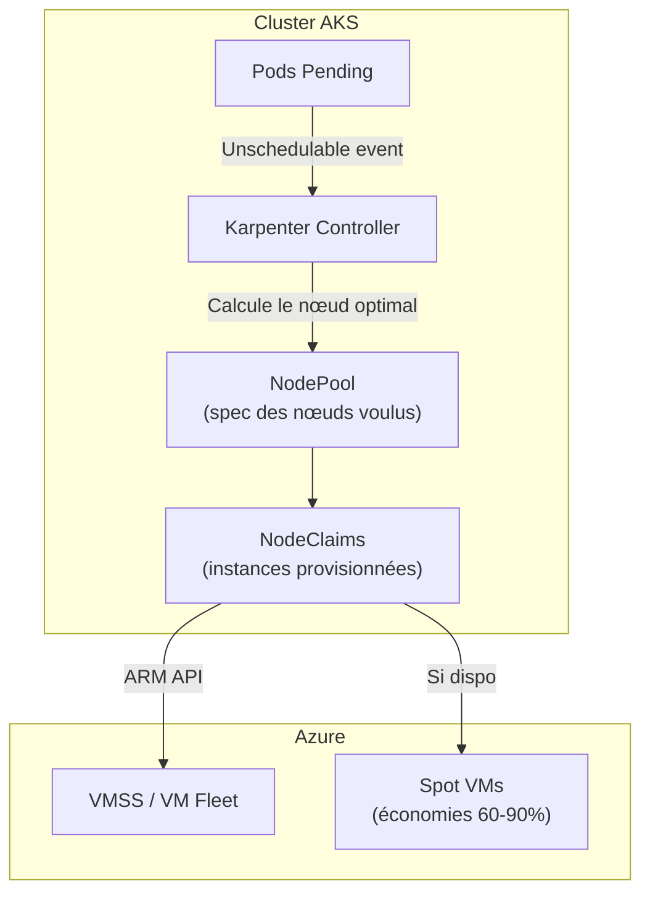

# Karpenter — Autoscaling de nœuds K8s

## C'est quoi ?

Karpenter est un autoscaler de **nœuds** Kubernetes. Quand un pod reste `Pending` faute de ressources, Karpenter provisionne le nœud optimal **en 30-60 secondes** en choisissant le bon type de VM. Il remplace le Cluster Autoscaler avec des avantages majeurs : consolidation proactive, support Spot natif, sans groupes de nœuds rigides.

| | Cluster Autoscaler | Karpenter |
|---|---|---|
| Temps de provisionnement | 3-5 min | 30-60 sec |
| Choix du type de VM | Fixé par le node group | Calculé dynamiquement |
| Consolidation | Basique | Proactive (bin-packing) |
| Spot | Manuel | Natif + fallback auto |
| Config | Node Groups (rigide) | NodePool (flexible) |

## Architecture



## Installation sur AKS (Node Auto Provisioning)

Azure intègre Karpenter via **Node Auto Provisioning (NAP)** — c'est la méthode recommandée pour AKS.

```bash
# Activer NAP sur un cluster existant
az aks update \
  --name aks-vtl-aks-prd-frc \
  --resource-group <rg> \
  --node-provisioning-mode Auto

# Vérifier l'activation
kubectl get nodepools.karpenter.azure.com

# Voir le NodePool par défaut créé par NAP
kubectl describe nodepool default
```

## Configurer un NodePool

```yaml
# tools/karpenter/manifests/nodepool.yaml
apiVersion: karpenter.sh/v1
kind: NodePool
metadata:
  name: default
spec:
  template:
    spec:
      requirements:
        - key: kubernetes.io/arch
          operator: In
          values: ["amd64"]
        - key: karpenter.sh/capacity-type
          operator: In
          values: ["spot", "on-demand"]  # Spot en priorité
        - key: karpenter.azure.com/sku-family
          operator: In
          values: ["D", "E"]  # Familles Azure optimisées
      nodeClassRef:
        apiVersion: karpenter.azure.com/v1alpha2
        kind: AKSNodeClass
        name: default
  limits:
    cpu: 100      # Max 100 vCPU dans ce pool
    memory: 400Gi
  disruption:
    consolidationPolicy: WhenEmptyOrUnderutilized
    consolidateAfter: 30s
```

## Utilisation

```bash
# Voir les nœuds gérés par Karpenter
kubectl get nodes -l karpenter.sh/registered=true

# Voir les NodeClaims (une instance par nœud)
kubectl get nodeclaims

# Voir pourquoi un pod est Pending (Karpenter va agir)
kubectl describe pod <pod-pending>

# Forcer la consolidation (supprime nœuds vides)
kubectl annotate nodepool default \
  karpenter.sh/voluntary-disruption=underutilized --overwrite

# Voir les events Karpenter
kubectl get events -n kube-system --field-selector reason=ProvisioningSucceeded
```

## Économies Spot

Karpenter gère automatiquement les interruptions Spot Azure (préavis 30s) :

1. Reçoit l'alerte d'interruption via l'API de métadonnées Azure
2. Cordon + drain du nœud Spot
3. Reprovisionne sur un autre type de VM (Spot ou On-demand)

```yaml
# Exemple : préférer Spot, fallback On-demand
requirements:
  - key: karpenter.sh/capacity-type
    operator: In
    values: ["spot", "on-demand"]  # ordre = priorité
```

## Liens

- [[_index|← Retour Infrastructure]]
- [[k3d|k3d — Cluster local (Karpenter non applicable localement)]]
- [[crossplane|Crossplane — Autre approche IaC K8s-native]]
