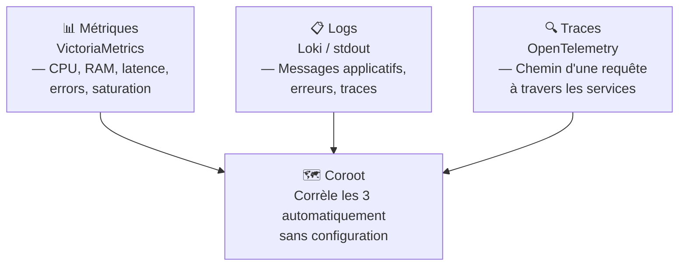

# 02 — Observabilité

Les outils de cette section permettent de **voir ce qui se passe** dans tes systèmes : métriques, logs, traces, dépendances entre services.

## Contenu

- [[coroot|Coroot — Observabilité automatique]]
- [[victoria-metrics|VictoriaMetrics — Stockage métriques]]
- [[perses|Perses — Dashboards as Code]]
- [[opentelemetry|OpenTelemetry — Traces, métriques, logs unifiés]]
- [[ollama|Ollama + Open WebUI — LLMs locaux]]

## Les trois piliers de l'observabilité

## Stack recommandée par cas d'usage

| Besoin | Outil |
|---|---|
| Voir les dépendances entre services automatiquement | [[coroot\|Coroot]] |
| Remplacer Prometheus/Mimir (moins de RAM) | [[victoria-metrics\|VictoriaMetrics]] |
| Dashboards versionnés dans Git | [[perses\|Perses]] |
| Alerting enrichi K8s | [[03-securite/robusta\|Robusta]] |

## Type d'installation

Tous les outils de cette section tournent en **Docker Compose** — pas besoin du cluster k3d.
