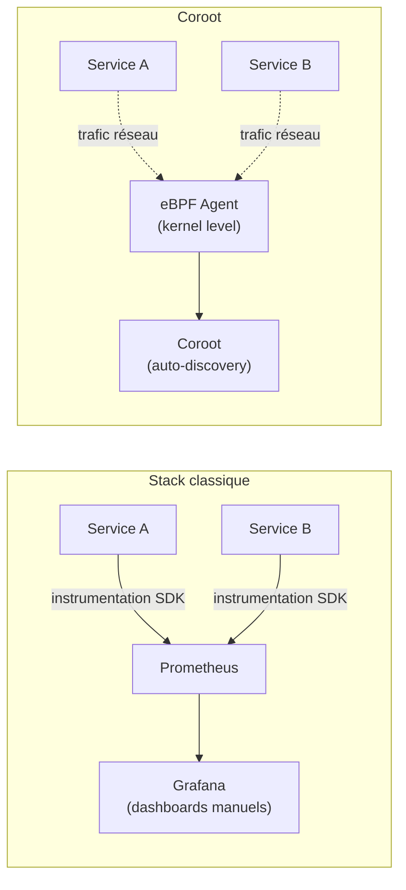
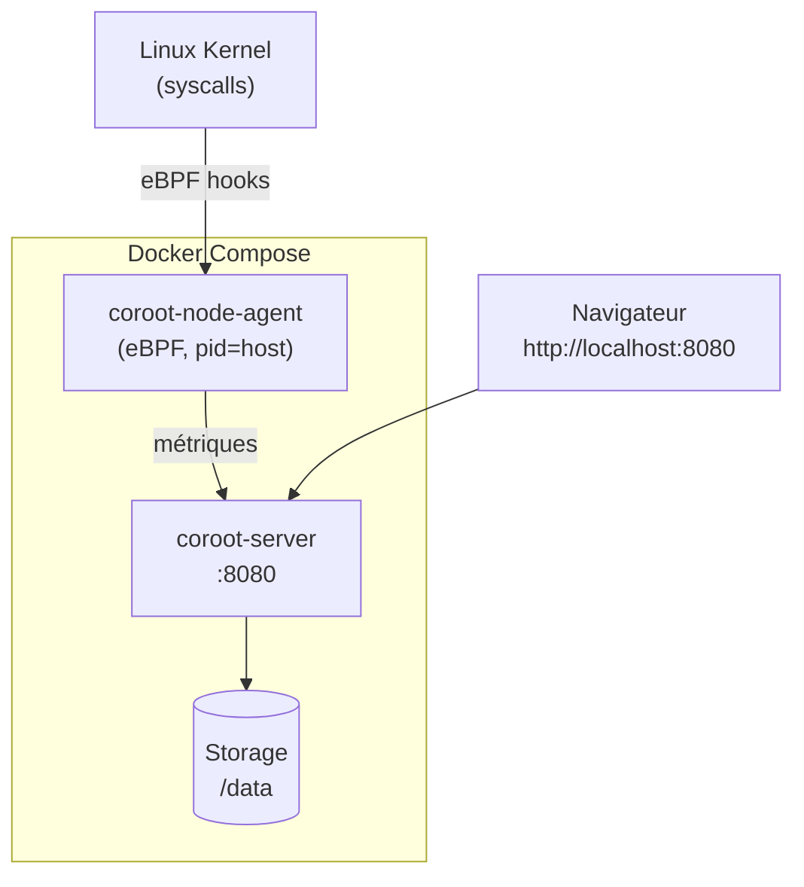

# Coroot — Observabilité automatique

## C'est quoi ?

Coroot est une plateforme d'observabilité **zero-config** basée sur eBPF. Elle découvre automatiquement tous tes services et leurs dépendances en observant le trafic réseau au niveau du kernel Linux — sans toucher au code applicatif.

## Pourquoi c'est différent de Grafana/Prometheus



Avec la stack classique : tu dois instrumenter chaque service, créer des dashboards, définir des alertes.

Avec Coroot : tu lances un agent, et en 2 minutes tu as la carte complète de tes dépendances avec métriques et alertes automatiques.

## Ce que Coroot détecte automatiquement

- Carte des dépendances entre services
- Latence p50 / p95 / p99 entre chaque paire de services
- Taux d'erreur HTTP / gRPC / DNS
- Requêtes SQL (MySQL, PostgreSQL, Redis)
- Utilisation CPU et RAM par container
- Logs corrélés avec les métriques

## Architecture dans le lab



## Démarrage

```bash
cd tools/coroot
docker compose up -d

# Vérifier que les containers tournent
docker compose ps

# Voir les logs
docker compose logs -f coroot
```

Accès : **http://localhost:8080**

## Première utilisation (5 minutes)

1. Ouvre **http://localhost:8080**
2. Coroot scanne automatiquement les containers Docker actifs
3. La **Service Map** apparaît — carte interactive de tes services
4. Clique sur un service pour voir :
   - Latence en temps réel
   - Taux d'erreur
   - Ressources consommées
   - Logs associés

## Interpréter la Service Map

```
[nginx] ──► [api-backend] ──► [postgres]
              │
              └──► [redis]
```

- **Ligne verte** : service sain, latence normale
- **Ligne orange** : latence dégradée (p95 > seuil)
- **Ligne rouge** : erreurs détectées
- **Épaisseur** : volume de trafic

## Arrêter / nettoyer

```bash
# Arrêter sans supprimer les données
docker compose stop

# Supprimer complètement
docker compose down -v
```

## Liens

- [[_index|← Retour Observabilité]]
- [[victoria-metrics|VictoriaMetrics — Pour stocker les métriques long terme]]
