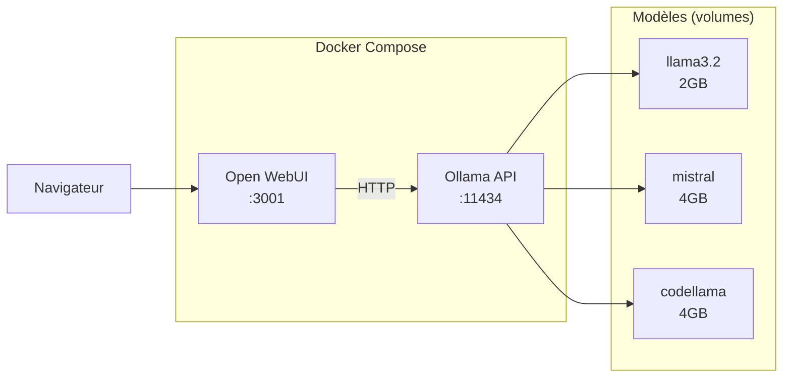

# Ollama + Open WebUI — LLMs locaux

## C'est quoi ?

**Ollama** est un runtime pour faire tourner des LLMs open source (Llama 3, Mistral, Phi-3, Gemma, CodeLlama...) **en local**, sans cloud, sans frais d'API. **Open WebUI** est l'interface graphique — une UI identique à ChatGPT qui se connecte à Ollama.

Cas d'usage DevOps : analyser des logs, générer des scripts, poser des questions sur ton infra sans envoyer de données en dehors de ta machine.

## Architecture



## Démarrage

```bash
cd ~/dev/devops-labs/tools/ollama
docker compose up -d

# Attendre que Ollama soit prêt
curl http://localhost:11434/api/version

# Télécharger un modèle léger
docker exec ollama ollama pull llama3.2
```

## Utilisation

### Via Open WebUI (http://localhost:3001)

1. S'inscrire (compte local, pas de cloud)
2. Choisir un modèle dans la liste
3. Chatter normalement

### Via API (pour scripts)

```bash
# Générer du texte
curl http://localhost:11434/api/generate \
  -d '{
    "model": "llama3.2",
    "prompt": "Génère un script bash pour vérifier l état des pods K8s",
    "stream": false
  }' | python3 -c "import sys,json; print(json.load(sys.stdin)['response'])"

# Chat avec contexte
curl http://localhost:11434/api/chat \
  -d '{
    "model": "mistral",
    "messages": [
      {"role": "user", "content": "Explique eBPF en 3 lignes"}
    ]
  }'
```

### Cas d'usage DevOps

```bash
# Analyser un log d'erreur
cat /var/log/app.log | docker exec -i ollama ollama run llama3.2 \
  "Analyse ce log et identifie les erreurs critiques:"

# Générer une règle d'alerte Prometheus
docker exec ollama ollama run mistral \
  "Génère une règle d'alerte Prometheus pour détecter un pod en CrashLoopBackOff"
```

## Modèles recommandés

| Modèle | RAM | Vitesse | Meilleur pour |
|---|---|---|---|
| `llama3.2` | 4 GB | Rapide | Général, questions courtes |
| `mistral` | 8 GB | Moyen | Raisonnement, analyse |
| `codellama` | 8 GB | Moyen | Génération de code |
| `phi3` | 4 GB | Très rapide | Résumés, classification |
| `nomic-embed-text` | 1 GB | Très rapide | Embeddings pour RAG |

## Liens

- [[_index|← Retour Observabilité]]
- [[../04-outils/_index|04-outils]]
