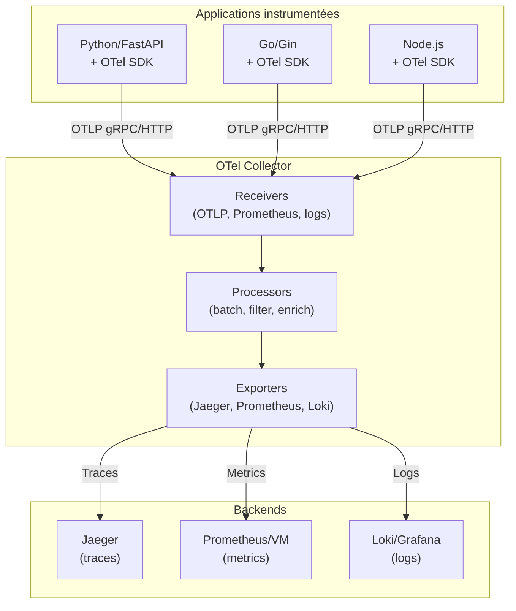

# OpenTelemetry — Observabilité unifiée

## C'est quoi ?

OpenTelemetry (OTel) est le **standard CNCF** pour instrumenter les applications : il définit un SDK unique et un protocole (OTLP) pour envoyer traces, métriques et logs vers n'importe quel backend (Jaeger, Grafana Tempo, Datadog, Prometheus...). Fini les SDKs propriétaires : une instrumentation, tous les backends.

**Avant** : SDK Jaeger pour les traces, SDK Datadog pour les métriques, SDK Elastic pour les logs
**Avec OTel** : un seul `opentelemetry-sdk`, un seul exporter OTLP → choix du backend découplé

## Architecture



## Démarrage (Docker Compose)

```bash
cd ~/dev/devops-labs/tools/opentelemetry
docker compose up -d

# Vérifier le health du collector
curl http://localhost:13133/

# Jaeger UI → http://localhost:16686
```

## Instrumenter une app Python

```bash
pip install opentelemetry-distro opentelemetry-exporter-otlp
opentelemetry-bootstrap -a install

# Lancer l'app avec auto-instrumentation
OTEL_SERVICE_NAME=mon-api \
OTEL_EXPORTER_OTLP_ENDPOINT=http://localhost:4318 \
OTEL_EXPORTER_OTLP_PROTOCOL=http/protobuf \
opentelemetry-instrument uvicorn main:app
```

## Instrumenter une app Go

```go
import (
    "go.opentelemetry.io/otel"
    "go.opentelemetry.io/otel/exporters/otlp/otlptrace/otlptracehttp"
)

// Initialiser le tracer
exporter, _ := otlptracehttp.New(ctx,
    otlptracehttp.WithEndpoint("localhost:4318"),
    otlptracehttp.WithInsecure(),
)

// Créer des spans
tracer := otel.Tracer("mon-service")
ctx, span := tracer.Start(ctx, "ma-fonction")
defer span.End()
```

## Variables d'environnement OTLP

```bash
# Endpoint du collector
export OTEL_EXPORTER_OTLP_ENDPOINT=http://localhost:4318

# Nom du service (apparaît dans Jaeger/Grafana)
export OTEL_SERVICE_NAME=carene-api

# Attributs additionnels
export OTEL_RESOURCE_ATTRIBUTES="deployment.environment=staging,team=carene"

# Protocole (http/protobuf ou grpc)
export OTEL_EXPORTER_OTLP_PROTOCOL=http/protobuf
```

## Intégration avec Grafana Cloud

Pour envoyer directement vers Grafana Cloud sans passer par un collector local :

```yaml
# Dans otel-config.yaml — ajouter un exporter Grafana Cloud
exporters:
  otlphttp/grafana:
    endpoint: https://otlp-gateway-prod-eu-west-2.grafana.net/otlp
    headers:
      authorization: "Basic <base64(instanceID:token)>"
```

## Liens

- [[_index|← Retour Observabilité]]
- [[coroot|Coroot — utilise aussi eBPF pour les traces]]
- [[victoria-metrics|VictoriaMetrics — peut recevoir les métriques OTel]]
