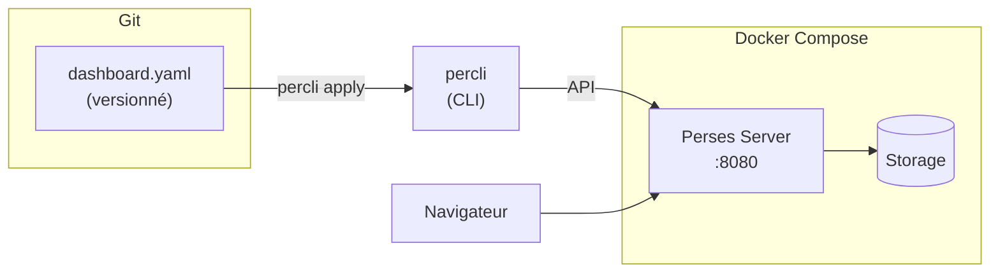

# Perses — Dashboards as Code

## C'est quoi ?

Perses est un projet CNCF créé par l'équipe core de Grafana. C'est le successeur de Grafana pensé dès le départ pour le **GitOps** : les dashboards sont des fichiers YAML versionnés dans Git, reviewés en PR, déployés automatiquement.

## Problème avec Grafana actuel

Avec Grafana classique :
- Les dashboards sont stockés dans une base de données SQLite/PostgreSQL
- On les exporte en JSON pour les versionner → pas vraiment lisible
- Pas de diff propre en PR
- Recréer un dashboard sur un nouveau Grafana = galère

Avec Perses :
```yaml
# dashboard.yaml — versionné dans Git, reviewé en PR
kind: Dashboard
metadata:
  name: kubernetes-overview
spec:
  panels:
    - kind: Panel
      spec:
        display:
          name: CPU Usage
        plugin:
          kind: TimeSeriesChart
```

## Architecture dans le lab



## Démarrage

```bash
cd tools/perses
docker compose up -d
```

Accès : **http://localhost:8080**

## Installer le CLI percli

```bash
curl -LO https://github.com/perses/perses/releases/latest/download/percli_linux_amd64.tar.gz
tar -xzf percli_linux_amd64.tar.gz
sudo mv percli /usr/local/bin/
percli version

# Configurer le CLI
percli config add-context local --url http://localhost:8080
percli config use-context local
```

## Créer un premier dashboard

```yaml
# mon-dashboard.yaml
kind: Dashboard
metadata:
  name: mon-premier-dashboard
  project: default
spec:
  display:
    name: Mon Premier Dashboard
  duration: 1h
  datasources:
    prometheus:
      default: true
      plugin:
        kind: PrometheusDatasource
        spec:
          directUrl: http://victoria-metrics:8428
  panels:
    - kind: Panel
      spec:
        display:
          name: CPU Total
        plugin:
          kind: TimeSeriesChart
        queries:
          - kind: TimeSeriesQuery
            spec:
              plugin:
                kind: PrometheusTimeSeriesQuery
                spec:
                  query: rate(process_cpu_seconds_total[5m])
```

```bash
# Appliquer
percli apply -f mon-dashboard.yaml

# Voir dans le browser
# http://localhost:8080
```

## Workflow GitOps complet

```
1. Créer/modifier dashboard.yaml
2. git commit + push
3. PR review (le YAML est lisible !)
4. Merge → percli apply automatique (CI/CD)
```

## CRD Kubernetes (avancé)

Perses peut aussi s'installer dans K8s comme operator, avec des `PersesDashboard` resources :

```yaml
apiVersion: perses.dev/v1alpha1
kind: PersesDashboard
metadata:
  name: mon-dashboard
  namespace: monitoring
spec:
  # ... même spec que le YAML ci-dessus
```

## Liens

- [[_index|← Retour Observabilité]]
- [[victoria-metrics|VictoriaMetrics — Datasource recommandée pour Perses]]
