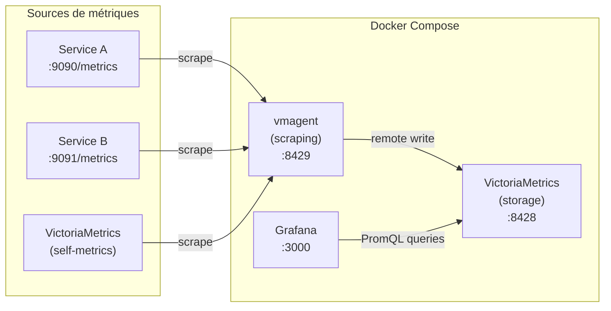

# VictoriaMetrics — Stockage métriques haute performance

## C'est quoi ?

VictoriaMetrics est une base de données **time-series** compatible PromQL qui remplace Prometheus et Mimir. Elle stocke les métriques de façon beaucoup plus efficace : même charge, 10x moins de RAM et 10x moins d'espace disque.

## Comparatif

| Critère | Prometheus | Grafana Mimir | VictoriaMetrics |
|---|---|---|---|
| RAM pour 1M séries actives | ~8 GB | ~4 GB | **~1 GB** |
| Compression disque | 1x | 2x | **10x** |
| Compatibilité PromQL | Native | Native | Native |
| Setup | Simple | Complexe (microservices) | **Simple** |
| Rétention long terme | Limité | Oui | Oui |
| Coût infra | Moyen | Élevé | **Faible** |

**Cas d'usage** : si tes coûts Grafana Cloud montent, VictoriaMetrics en self-hosted peut remplacer Mimir à une fraction du coût.

## Architecture dans le lab



## Démarrage

```bash
cd tools/victoria-metrics
docker compose up -d

# Vérifier
docker compose ps
```

Accès :
- **VictoriaMetrics UI** : http://localhost:8428/vmui
- **VMAgent UI** : http://localhost:8429
- **Grafana** : http://localhost:3000 (admin / admin)

## Ajouter des cibles à scraper

Éditer `tools/victoria-metrics/scrape.yml` :

```yaml
scrape_configs:
  - job_name: mon-service
    static_configs:
      - targets: ["host.docker.internal:9090"]
    # Si le service tourne dans Docker :
    # - targets: ["mon-container:9090"]
```

Recharger sans redémarrer :
```bash
curl -X POST http://localhost:8429/-/reload
```

## Requêtes PromQL essentielles

```promql
# CPU par process
rate(process_cpu_seconds_total[5m])

# RAM en MB
process_resident_memory_bytes / 1024 / 1024

# Taux de requêtes HTTP
rate(http_requests_total[5m])

# Latence p95
histogram_quantile(0.95, rate(http_request_duration_seconds_bucket[5m]))

# Taux d'erreur (status >= 500)
rate(http_requests_total{status=~"5.."}[5m])
  / rate(http_requests_total[5m])
```

## Ajouter VictoriaMetrics comme datasource Grafana

1. Ouvre Grafana → Configuration → Data Sources
2. Ajouter → **Prometheus**
3. URL : `http://victoria-metrics:8428`
4. Save & Test

Tes dashboards Prometheus existants fonctionnent sans modification.

## Remote Write depuis un Prometheus existant

Si tu veux envoyer les métriques d'un Prometheus existant vers VictoriaMetrics :

```yaml
# prometheus.yml
remote_write:
  - url: http://victoria-metrics:8428/api/v1/write
```

## Liens

- [[_index|← Retour Observabilité]]
- [[perses|Perses — Pour des dashboards versionnés dans Git]]
- [[coroot|Coroot — Alternative zero-config]]
