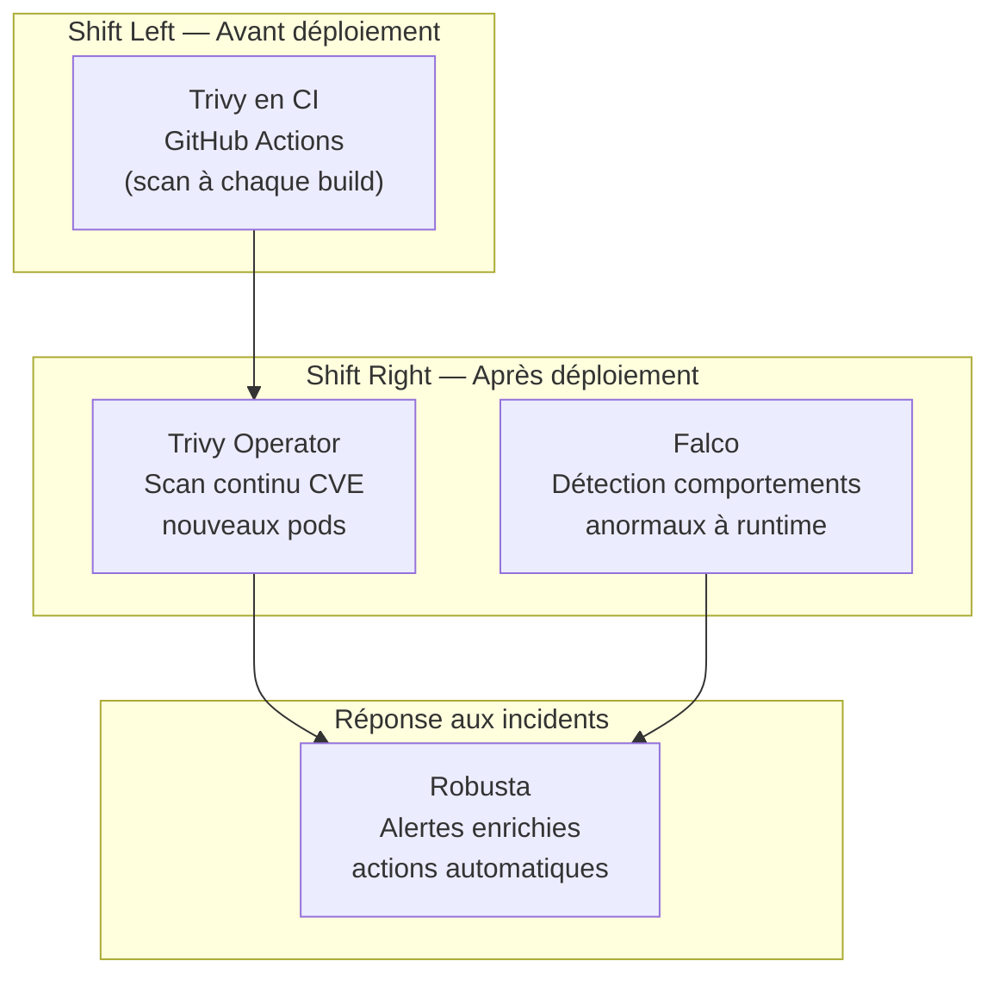

# 03 — Sécurité

Les outils de cette section couvrent la sécurité à plusieurs niveaux du cycle de vie K8s.

## Contenu

- [[trivy-operator|Trivy Operator — Scan CVE continu]]
- [[falco|Falco — Détection runtime d'anomalies]]
- [[robusta|Robusta — Alerting K8s enrichi]]

## Les 3 couches de sécurité K8s



## Tous les outils nécessitent le cluster k3d

```bash
# S'assurer que le cluster est démarré
k3d cluster start devops-lab
kubectl config use-context k3d-devops-lab
```
