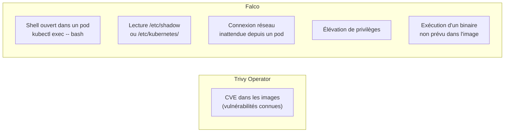
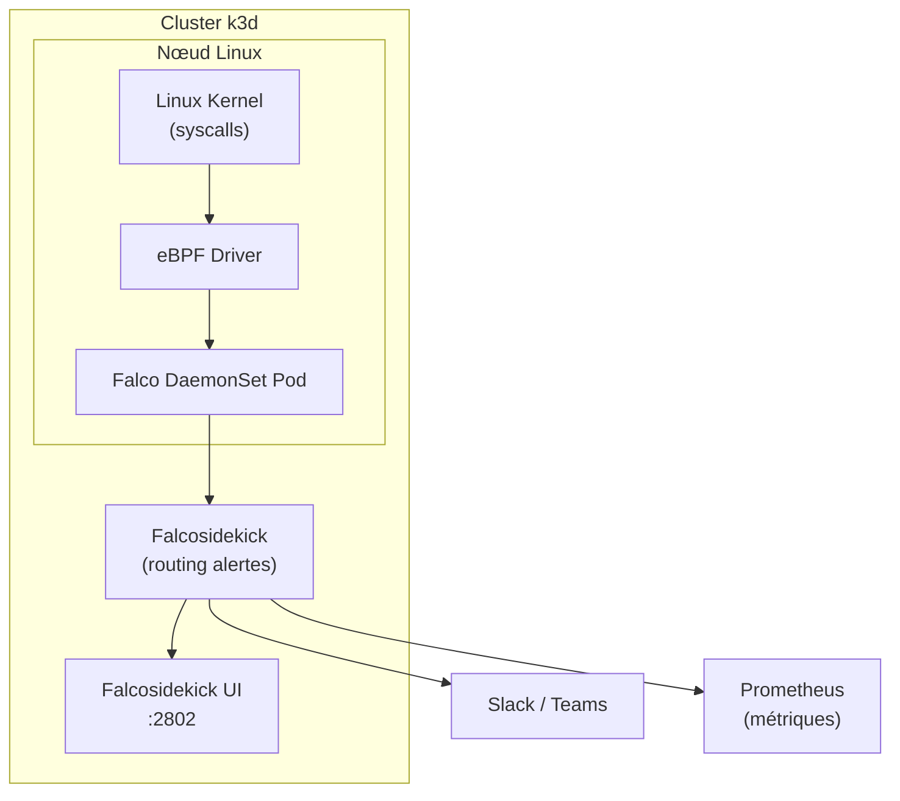

# Falco — Détection runtime d'anomalies

## C'est quoi ?

Falco surveille en temps réel les **appels système** (syscalls) de tous tes containers via eBPF. Il déclenche des alertes quand un comportement suspect est détecté — shell ouvert dans un pod, accès à un fichier sensible, connexion réseau inattendue.

## Ce que Trivy Operator ne détecte pas (et Falco si)



Falco protège contre les **attaques en cours**, pas les vulnérabilités statiques.

## Architecture



## Installation dans k3d

```bash
helm repo add falcosecurity https://falcosecurity.github.io/charts
helm repo update

helm install falco falcosecurity/falco \
  --namespace falco \
  --create-namespace \
  --set driver.kind=ebpf \
  --set falcosidekick.enabled=true \
  --set falcosidekick.webui.enabled=true \
  --set falcosidekick.webui.service.type=NodePort

# Attendre que les pods soient Ready
kubectl wait --for=condition=Ready pods --all -n falco --timeout=120s
kubectl get pods -n falco
```

## Accès à l'UI

```bash
kubectl port-forward svc/falco-falcosidekick-ui 2802:2802 -n falco
# Ouvre http://localhost:2802
```

## Voir les alertes en temps réel

```bash
# Logs du DaemonSet
kubectl logs -l app.kubernetes.io/name=falco -n falco -f

# Filtrer par priorité
kubectl logs -l app.kubernetes.io/name=falco -n falco -f | grep -i "warning\|critical"
```

## Tester Falco (déclencher une alerte)

```bash
# Terminal 1 — regarder les alertes
kubectl logs -l app.kubernetes.io/name=falco -n falco -f &

# Terminal 2 — ouvrir un shell dans un pod
kubectl run test-falco --image=ubuntu:22.04 --restart=Never -it -- bash

# → Falco doit alerter :
# Warning Spawned a shell inside a container
#   container=test-falco image=ubuntu shell=bash pid=12345
```

## Règles Falco par défaut (les plus utiles)

| Règle | Ce qu'elle détecte |
|---|---|
| `Terminal shell in container` | `kubectl exec` ou shell dans un pod |
| `Read sensitive file untrusted` | Lecture de `/etc/shadow`, `/etc/kubernetes/` |
| `Write below etc` | Modification de fichiers dans `/etc/` |
| `Outbound Connection to C2 Servers` | Connexion vers des IPs de command & control connus |
| `Container Run as Root` | Pod qui tourne en root |
| `Netcat Remote Code Execution` | Exécution de `nc` dans un container |

## Règle personnalisée

```yaml
# custom-rules.yaml
customRules:
  rules-custom.yaml: |-
    - rule: Lecture secrets Kubernetes
      desc: Détecte l'accès aux secrets montés dans les pods
      condition: >
        open_read and container and
        fd.name startswith /var/run/secrets/kubernetes.io
      output: >
        Secret K8s lu (user=%user.name fichier=%fd.name
        pod=%k8s.pod.name namespace=%k8s.ns.name)
      priority: WARNING
      tags: [kubernetes, secrets]
```

```bash
helm upgrade falco falcosecurity/falco \
  --namespace falco \
  --values custom-rules.yaml
```

## Liens

- [[_index|← Retour Sécurité]]
- [[trivy-operator|Trivy Operator — Complémentaire pour les CVE statiques]]
- [[robusta|Robusta — Pour router les alertes Falco vers Slack/Teams]]
