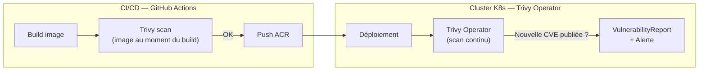

# Trivy Operator — Scan CVE continu dans K8s

## C'est quoi ?

Trivy Operator est la version **in-cluster** de Trivy. Il tourne en permanence dans le cluster et scanne automatiquement chaque image déployée. Les résultats sont stockés comme des ressources Kubernetes natives (CRDs), visibles avec `kubectl`.

## Complément au Trivy CI

Tu as déjà Trivy dans tes GitHub Actions. Les deux sont complémentaires :



**Trivy CI** : détecte les CVE connues **au moment du build**.  
**Trivy Operator** : détecte les **nouvelles CVE** publiées après le déploiement.

## Installation dans k3d

```bash
# Ajouter le repo Helm
helm repo add aqua https://aquasecurity.github.io/helm-charts/
helm repo update

# Installer
helm install trivy-operator aqua/trivy-operator \
  --namespace trivy-system \
  --create-namespace \
  --set trivy.ignoreUnfixed=true \
  --set operator.scanJobTimeout=5m

# Vérifier
kubectl get pods -n trivy-system
```

## Utilisation

```bash
# Voir tous les rapports de vulnérabilités
kubectl get vulnerabilityreports -A

# Output formaté
kubectl get vulnerabilityreports -A \
  -o custom-columns=\
"NAMESPACE:.metadata.namespace,\
NAME:.metadata.name,\
CRITICAL:.report.summary.criticalCount,\
HIGH:.report.summary.highCount,\
MEDIUM:.report.summary.mediumCount"

# Détail d'un rapport spécifique
kubectl describe vulnerabilityreport <nom> -n <namespace>

# Seulement les CRITICAL
kubectl get vulnerabilityreports -A -o json | jq '
  .items[] 
  | select(.report.summary.criticalCount > 0) 
  | {
      namespace: .metadata.namespace,
      name: .metadata.name,
      critical: .report.summary.criticalCount,
      image: .report.artifact.repository
    }'
```

## Exemple de sortie

```
NAMESPACE   NAME                          CRITICAL   HIGH   MEDIUM
default     deploy-nginx-7d9f-nginx           2       15      43
default     deploy-api-6c8b-api               0        3      12
monitoring  deploy-grafana-8b2c-grafana       1        8      29
```

## Config Audit (bonnes pratiques K8s)

Trivy Operator vérifie aussi les mauvaises configurations K8s :

```bash
# Voir les audits de configuration
kubectl get configauditreports -A

# Exemples de règles vérifiées :
# - Container sans limits CPU/RAM
# - Container qui tourne en root
# - Pas de readinessProbe
# - Image avec tag latest
# - Capabilities dangereuses
```

## Dashboard Grafana

Trivy Operator expose des métriques Prometheus. Importer le dashboard communautaire :

1. Grafana → Import
2. Dashboard ID : **17813**
3. Datasource : VictoriaMetrics ou Prometheus

## Liens

- [[_index|← Retour Sécurité]]
- [[falco|Falco — Détection comportements suspects à runtime]]
- [[robusta|Robusta — Pour recevoir les alertes CVE dans Slack/Teams]]
