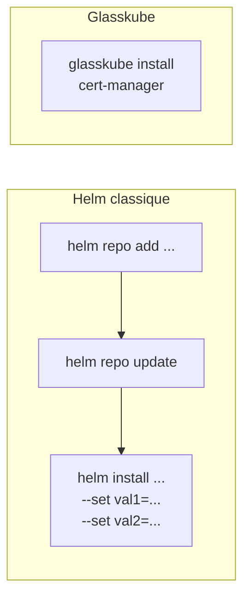
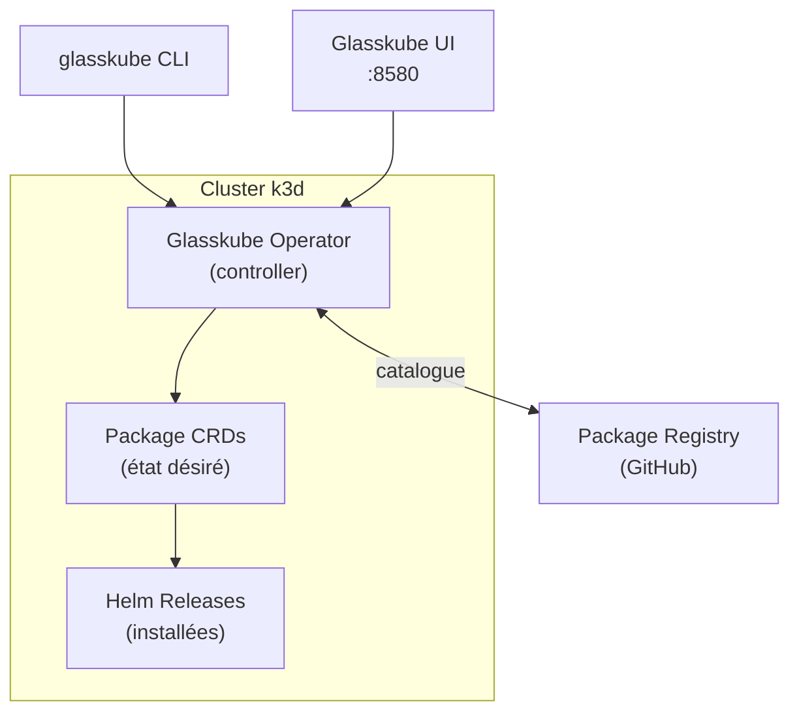

# Glasskube — Package Manager K8s moderne

## C'est quoi ?

Glasskube est un gestionnaire de paquets pour Kubernetes avec une **UI web** et une CLI moderne. L'équivalent de `apt` ou `brew` pour K8s : installe, met à jour et gère les dépendances entre outils K8s en un clic ou une commande.

## Comparatif avec Helm



Helm reste la technologie sous-jacente — Glasskube simplifie l'interface.

## Architecture



## Installation CLI

```bash
curl -LO https://github.com/glasskube/glasskube/releases/latest/download/glasskube_linux_amd64.tar.gz
tar -xzf glasskube_linux_amd64.tar.gz
sudo mv glasskube /usr/local/bin/
glasskube version
```

## Bootstrap dans le cluster

```bash
# S'assurer d'être sur k3d
kubectl config use-context k3d-devops-lab

# Installer le controller Glasskube
glasskube bootstrap

# Ouvrir l'UI
glasskube serve
# → http://localhost:8580
```

## Utilisation CLI

```bash
# Lister les paquets disponibles
glasskube repo list

# Chercher un paquet
glasskube search prometheus

# Installer
glasskube install cert-manager
glasskube install kube-prometheus-stack
glasskube install argo-cd
glasskube install external-secrets
glasskube install trivy-operator

# Voir ce qui est installé
glasskube list

# Mettre à jour un paquet
glasskube update cert-manager

# Désinstaller
glasskube uninstall cert-manager
```

## Utilisation UI (http://localhost:8580)

1. **Packages** — catalogue de tous les paquets disponibles
2. **Installed** — ce qui tourne dans le cluster
3. **Updates** — paquets avec une nouvelle version disponible
4. Un clic → Install / Update / Uninstall

## Catalogue disponible (sélection)

| Paquet | Catégorie |
|---|---|
| cert-manager | Certificats TLS |
| argo-cd | GitOps CD |
| kube-prometheus-stack | Monitoring complet |
| external-secrets | Gestion secrets |
| ingress-nginx | Ingress controller |
| velero | Backup cluster |
| trivy-operator | Sécurité CVE |
| falco | Sécurité runtime |
| cloudnative-pg | PostgreSQL operator |

## Cas d'usage idéal

Bootstrapper un nouveau cluster de zéro avec tous les outils en quelques minutes :

```bash
glasskube bootstrap
glasskube install cert-manager
glasskube install ingress-nginx
glasskube install kube-prometheus-stack
glasskube install external-secrets
glasskube install argo-cd
```

vs la même chose avec Helm : ~30 commandes, plusieurs valeurs à chercher.

## Liens

- [[_index|← Retour Outils]]
- [[k8sgpt|k8sgpt — Outil à installer avec Glasskube]]
- [[01-infrastructure/k3d|k3d — Cluster où utiliser Glasskube]]
