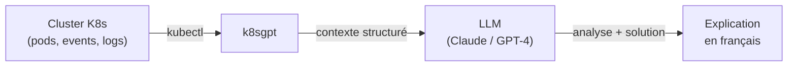

# k8sgpt — Analyse K8s par IA

## C'est quoi ?

k8sgpt analyse ton cluster Kubernetes et **explique les problèmes en langage naturel** via un LLM. Il lit les events, les logs, l'état des ressources, et te dit en clair ce qui ne va pas et comment le corriger.

## Flux d'analyse



## Installation

```bash
curl -LO https://github.com/k8sgpt-ai/k8sgpt/releases/latest/download/k8sgpt_linux_amd64.tar.gz
tar -xzf k8sgpt_linux_amd64.tar.gz
sudo mv k8sgpt /usr/local/bin/
k8sgpt version
```

## Configuration avec Claude (Anthropic)

```bash
k8sgpt auth add \
  --backend anthropic \
  --model claude-sonnet-4-6 \
  --password "sk-ant-..."

# Vérifier
k8sgpt auth list
```

## Utilisation

```bash
# Analyse complète du cluster
k8sgpt analyze --explain

# Par namespace
k8sgpt analyze --namespace production --explain

# Par type de ressource
k8sgpt analyze --filter Pod,Service --explain

# Output JSON
k8sgpt analyze --explain --output json

# Langue française
k8sgpt analyze --explain --language french
```

## Exemple de sortie

```
0 production/api-7d9f8b-xkp2q(api-deployment)
- Error: Back-off restarting failed container

AI Analysis:
Le container 'api' échoue au démarrage pour deux raisons :

1. La variable d'environnement DATABASE_URL est manquante.
   Le Secret 'app-secrets' référencé dans le Deployment n'existe
   pas dans le namespace 'production'.

2. La probe readinessProbe échoue car le service ne démarre
   pas correctement sans la connexion à la base.

Solution recommandée :
  kubectl create secret generic app-secrets \
    --from-literal=DATABASE_URL=postgresql://... \
    -n production
```

## Ce que k8sgpt analyse

| Ressource | Ce qu'il vérifie |
|---|---|
| Pods | CrashLoopBackOff, OOMKill, ImagePullError, Pending |
| Services | Endpoints manquants, sélecteurs incorrects |
| Ingress | Backend non trouvé, TLS mal configuré |
| PVC | Pending, storage class introuvable |
| Nodes | NotReady, ressources insuffisantes |
| ReplicaSets | Replicas indisponibles |

## Utilisation comme Operator K8s (continu)

```bash
helm repo add k8sgpt-operator https://charts.k8sgpt.ai/
helm install k8sgpt-operator k8sgpt-operator/k8sgpt-operator \
  --namespace k8sgpt-operator-system \
  --create-namespace

# Créer une K8sGPT resource
cat <<EOF | kubectl apply -f -
apiVersion: core.k8sgpt.ai/v1alpha1
kind: K8sGPT
metadata:
  name: k8sgpt-sample
  namespace: k8sgpt-operator-system
spec:
  ai:
    backend: anthropic
    model: claude-sonnet-4-6
    secret:
      name: k8sgpt-sample-secret
      key: openai-api-key
  noCache: false
  version: v0.3.29
EOF
```

## Liens

- [[_index|← Retour Outils]]
- [[glasskube|Glasskube — Pour installer facilement les outils dans K8s]]
- [[01-infrastructure/k3d|k3d — Cluster où tester k8sgpt]]
