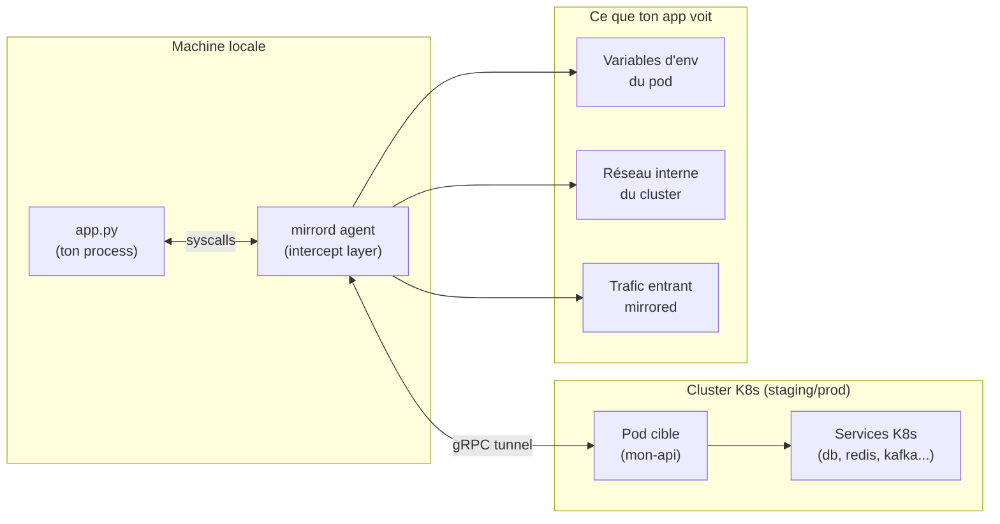

# Mirrord — Dev local connecté au cluster K8s

## C'est quoi ?

Mirrord est un outil de **Developer Experience** : il intercepte les syscalls de ton process local (réseau, variables d'env, fichiers) et les **redirige vers un pod K8s distant**. Ton app locale se comporte comme si elle tournait dans le cluster — sans build, sans push, sans redéploiement.

**Avant** : modifier le code → `docker build` → `docker push` → `kubectl rollout` → tester → 5-10 min/cycle
**Avec mirrord** : modifier le code → `mirrord exec -- python app.py` → tester → < 5 secondes

## Architecture



## Installation

```bash
# Script officiel
curl -fsSL https://raw.githubusercontent.com/metalbear-co/mirrord/main/scripts/install.sh | bash

# Ou via cargo
cargo install mirrord

# Vérifier
mirrord --version

# Extension VS Code (code completion + UI)
code --install-extension metalbear.mirrord
```

## Démarrage

```bash
# Vérifier que kubectl est configuré
kubectl config current-context

# Lancer ton app locale "dans" le cluster
mirrord exec \
  --target deployment/mon-api \
  --target-namespace staging \
  -- python app.py

# Raccourci : si tu as un mirrord.toml dans le dossier
mirrord exec -- python app.py
```

## Configuration (mirrord.toml)

```toml
# Placer à la racine du projet
[target]
path = "deployment/mon-api"
namespace = "staging"

[feature.network]
incoming = "mirror"   # "mirror" = copie, "steal" = redirige vers toi
outgoing = true       # tes appels HTTP sortent par le cluster

[feature.env]
include = ["DATABASE_URL", "REDIS_URL", "SECRET_*"]

[feature.fs]
mode = "local"  # lecture/écriture de fichiers reste locale
```

## Modes de trafic entrant

| Mode | Comportement | Quand utiliser |
|---|---|---|
| `mirror` | Copie le trafic entrant (pod + toi) | Staging/prod — inoffensif |
| `steal` | Redirige tout le trafic vers toi | Dev personnel — staging dédié |

## Cas d'usage YZY

```bash
# Débugger un pod en staging ALZ sans rebuild
mirrord exec \
  --target deployment/carene-api \
  --target-namespace carene-stg \
  -- python -m uvicorn main:app --reload

# Tester une fix en recevant le vrai trafic staging
mirrord exec \
  --steal \
  --target pod/carene-api-7d9f8b-xyz \
  --target-namespace carene-stg \
  -- python app.py
```

## Liens

- [[_index|← Retour Outils]]
- [[glasskube|Glasskube — installer d'autres outils K8s]]
- [[../01-infrastructure/k3d|k3d — Cluster local pour dev]]
