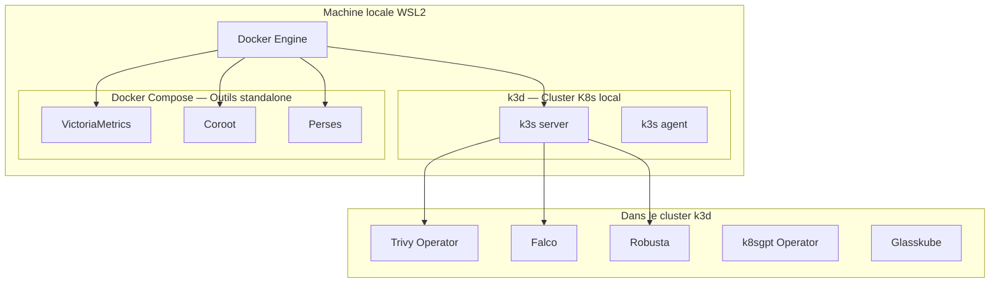

# DevOps Labs

Environnement de test local pour évaluer et maîtriser les outils DevOps 2026.

## Navigation

| Section | Contenu |
|---|---|
| [[01-infrastructure/_index\|01 — Infrastructure]] | k3d, architecture du lab |
| [[02-observabilite/_index\|02 — Observabilité]] | Coroot, VictoriaMetrics, Perses |
| [[03-securite/_index\|03 — Sécurité]] | Trivy Operator, Falco, Robusta |
| [[04-outils/_index\|04 — Outils K8s]] | k8sgpt, Glasskube |
| [[05-runbooks/_index\|05 — Runbooks]] | Procédures et recettes |
| [[glossaire\|Glossaire]] | Termes et acronymes |

## Architecture globale



## Démarrage rapide

```bash
# Cloner le repo sur un nouveau PC
git clone git@github.com:meherraddadi/devops-labs.git
cd devops-labs

# Bootstrap complet
bash scripts/setup.sh
```

## Philosophie du lab

Chaque outil est testé de façon **isolée et reproductible** :
- **Docker Compose** pour les outils standalone (pas besoin de K8s)
- **k3d** pour les outils qui nécessitent un vrai cluster K8s
- Un `README.md` dans chaque dossier `tools/` pour l'accès rapide
- Ce vault Obsidian pour la documentation approfondie

## Pré-requis système

- WSL2 (Ubuntu 22.04+)
- Docker Engine
- kubectl
- helm
- git
- k3d (installé par `setup.sh`)
